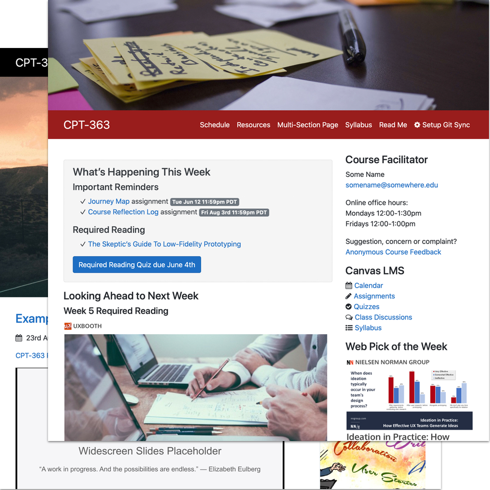

# Bootstrap4 Open Matter

Bootstrap4 Open Matter theme is a [Grav](http://github.com/getgrav/grav) inherited theme based on the [Bootstrap4](https://github.com/trilbymedia/grav-theme-bootstrap4) theme. In addition to built-in support for the [Git Sync Plugin](https://github.com/trilbymedia/grav-plugin-git-sync), a 'Chromeless' display mode (via the Page URL parameter `/chromeless:true` or a site-wide setting) is provided to better embed Grav page content into other platforms (e.g. LMSs).

## Bootstrap4 Open Matter Features

* Integrated support for the [Git Sync](https://github.com/trilbymedia/grav-plugin-git-sync) Plugin (i.e. view/edit pages in GitHub)
* 'Chromeless' page display (i.e. only display page content) for embedding pages in a 3rd party system
* Markdown-based sidebar widget
* Built-in Shortcodes - including Button, Embed.ly, H5P, iFrame, PDF, SpeakerDeck, Swipe and Twitter
* Featured posts (i.e. sticky posts)
* Option to toggle page summaries (i.e. summaries are not displayed with page content)
* Enhanced support for the [Presentation Plugin](https://github.com/OleVik/grav-plugin-presentation)
* Easy-to-use interface to create custom menubar items
* Creative Commons license display
* Web accessibility enhancements (i.e. hidden H1 page titles)

# Installation

Installing the Bootstrap4 Open Matter theme can be done in one of two ways. Our GPM (Grav Package Manager) installation method enables you to quickly and easily install the theme with a simple terminal command, while the manual method enables you to do so via a zip file.

## GPM Installation (Preferred)

The simplest way to install this theme is via the [Grav Package Manager (GPM)](http://learn.getgrav.org/advanced/grav-gpm) through your system's Terminal (also called the command line).  From the root of your Grav install type:

    bin/gpm install bootstrap4-open-matter

This will install the Bootstrap4 Open Matter theme into your `/user/themes` directory within Grav. Its files can be found under `/your/site/grav/user/themes/bootstrap4-open-matter`.

## Manual Installation

To install this theme, just download the zip version of this repository and unzip it under `/your/site/grav/user/themes`. Then, rename the folder to `bootstrap4-open-matter`. You can find these files either on [GitHub](https://github.com/hibbitts-design/grav-theme-bootstrap4-open-matter) or via [GetGrav.org](http://getgrav.org/downloads/themes).

You should now have all the theme files under

    /your/site/grav/user/themes/bootstrap4-open-matter

>> NOTE: This theme is a modular component for Grav which requires the [Grav](http://github.com/getgrav/grav), [Error](https://github.com/getgrav/grav-theme-error) and [Problems](https://github.com/getgrav/grav-plugin-problems) plugins.

# Updating

As development for the Bootstrap4 Open Matter theme continues, new versions may become available that add additional features and functionality, improve compatibility with newer Grav releases, and generally provide a better user experience. Updating Bootstrap4 Open Matter is easy, and can be done through Grav's GPM system, as well as manually.

## GPM Update (Preferred)

The simplest way to update this theme is via the [Grav Package Manager (GPM)](http://learn.getgrav.org/advanced/grav-gpm). You can do this with this by navigating to the root directory of your Grav install using your system's Terminal (also called command line) and typing the following:

    bin/gpm update bootstrap4-open-matter

This command will check your Grav install to see if your Bootstrap4 Open Matter theme is due for an update. If a newer release is found, you will be asked whether or not you wish to update. To continue, type `y` and hit enter. The theme will automatically update and clear Grav's cache.

## Manual Update

Manually updating Bootstrap4 Open Matter is pretty simple. Here is what you will need to do to get this done:

* Delete the `your/site/user/themes/bootstrap4-open-matter` directory.
* Download the new version of the Bootstrap4 Open Matter theme from either [GitHub](https://github.com/hibbitts-design/grav-theme-bootstrap4-open-matter) or [GetGrav.org](http://getgrav.org/downloads/themes).
* Unzip the zip file in `your/site/user/themes` and rename the resulting folder to `bootstrap4-open-matter`.
* Clear the Grav cache. The simplest way to do this is by going to the root Grav directory in terminal and typing `bin/grav clear-cache`.

> Note: Any changes you have made to any of the files listed under this directory will also be removed and replaced by the new set. Any files located elsewhere (for example a YAML settings file placed in `user/config/themes`) will remain intact.

## Dependencies

The Bootstrap4 Open Matter theme depends on the [Bootstrapper plugin](https://github.com/getgrav/grav-plugin-bootstrapper) to provide the appropriate CSS and JS.  If you install via GPM, you should be prompted to also install this plugin.  If not you should manually install via:

    bin/gpm install bootstrapper

# Setup

If you want to set Bootstrap4 Open Matter as the default theme, you can do so by following these steps:

* Navigate to `/your/site/grav/user/config`.
* Open the **system.yaml** file.
* Change the `theme:` setting to `theme: bootstrap4-open-matter`.
* Save your changes.
* Clear the Grav cache. The simplest way to do this is by going to the root Grav directory in Terminal and typing `bin/grav clear-cache`.

Once this is done, you should be able to see the new theme on the frontend. Keep in mind any customizations made to the previous theme will not be reflected as all of the theme and templating information is now being pulled from the **bootstrap4-open-matter** folder.
